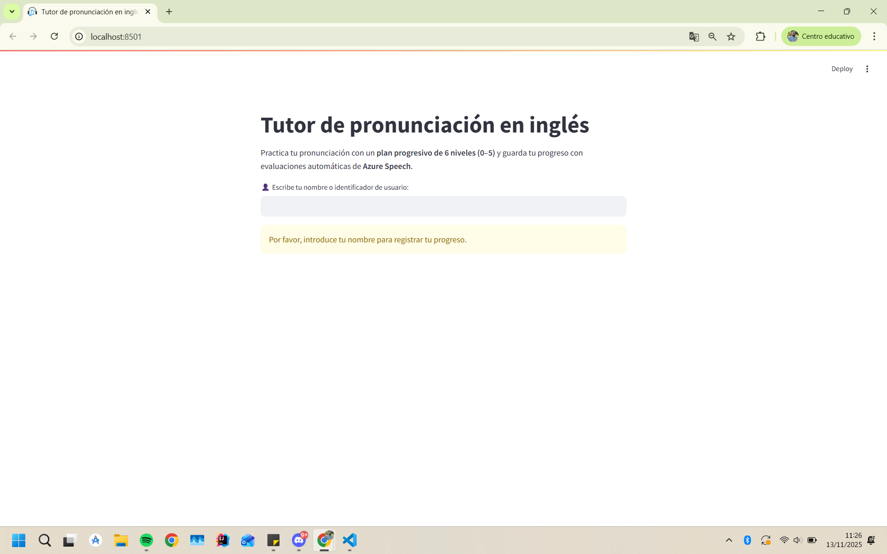
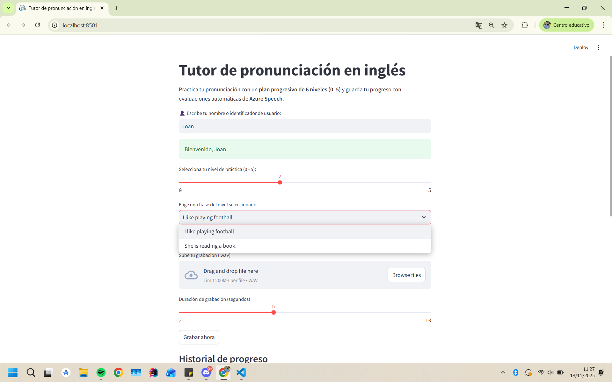
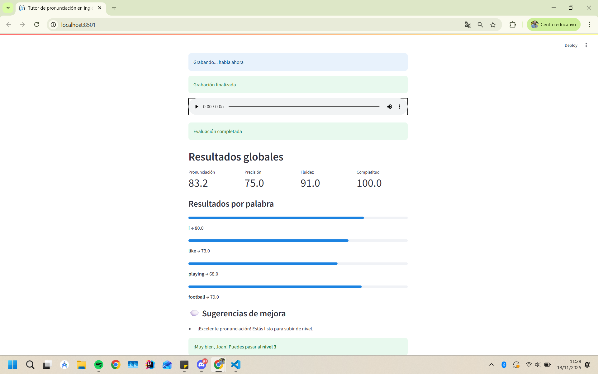

# 🎧 Tutor de pronunciación en inglés

Aplicación desarrollada en **Streamlit** que evalúa tu pronunciación usando el servicio **Azure Speech**.  
Permite grabar o subir tu voz, comparar con frases modelo y ver sugerencias automáticas, progreso y evolución por nivel.

---

## 🚀 Características principales
- 6 niveles progresivos de dificultad (0 a 5).
- Evaluación automática de:
  - Pronunciación  
  - Precisión  
  - Fluidez  
  - Completitud
- Historial de progreso por usuario con gráficas interactivas.
- Sugerencias automáticas personalizadas.
- Integración con Azure Speech Service.

## 🖥️ Capturas y demostración

| Interfaz principal | Resultados globales | Historial de progreso |
|--------------------|---------------------|-----------------------|

|  |  |   | 

---

Tendras que crear un archivo .env para añadir tus claves de azure, un ejemplo:
SPEECH_KEY=tu clave
SPEECH_REGION=tu región

Para usar streamlit cloud deberas de utilizar el app2, ya que soundevice no es compatible con streamlit cloud por lo que que hacemos es que el usuario suba el audio desde el dispositivo